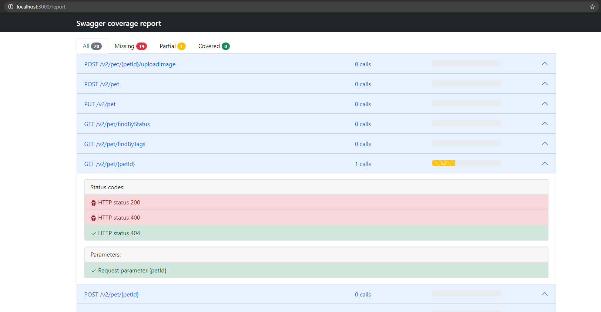

## Reqover

Reqover is language agnostic tool that gives a picture about coverage of APIs based on Open API (Swagger).

### Usage example:

For basic example you can use https://petstore.swagger.io

1. Start recoder
```
docker run -p 3000:3000 -v $PWD:/reqover reqover/reqover-cli record -t https://petstore.swagger.io
```

Setup API URL, Swagger specification url and save

```
curl --location --request GET 'http://localhost:3000/v2/pet/9222968140497128105'
```

2. Run tests and observe folder reqover-results
3. Download swagger.json file https://petstore.swagger.io/v2/swagger.json
4. Run command to generate coverage report

```
npx reqover generate -f swagger.json -d reqover-results --html
```
Or using docker

```
docker run -v $PWD:/reqover \
-v $PWD/data:/tmp/data \
-v $PWD/swagger.json:/tmp/swagger.json \
reqover/reqover-cli generate -f /tmp/swagger.json -d /tmp/data -p /v2 --html 
```

Folder .reqover should appear

```
npx reqover serve
```

5. Open browser at http://localhost:3000

#### Configuration:

As advanced config, it's possible to use reqover.config.json file:

- includeOptionalParams (default: false) - allows to inlude optonal params in coverage calculation score
- ignore - allows to ignore specific status code globally or per endpoint

```
{
  "includeOptionalParams": true,
  "ignore": {
    "status": [405, 404],
    "/v2/pet": {
      "POST": {
        "status": [405]
      }
    }
  }
}
```

Use it during report generation adding --config cli option:

```
npx reqover generate -f swagger.json -d reqover-results --html --config reqover.config.json
```

Examples:

- [Reqover Java and Spring boot](https://github.com/reqover/reqover-spring-boot)
- [Reqover Python and FastAPI](https://github.com/reqover/reqover-fast-api)

Report example:


